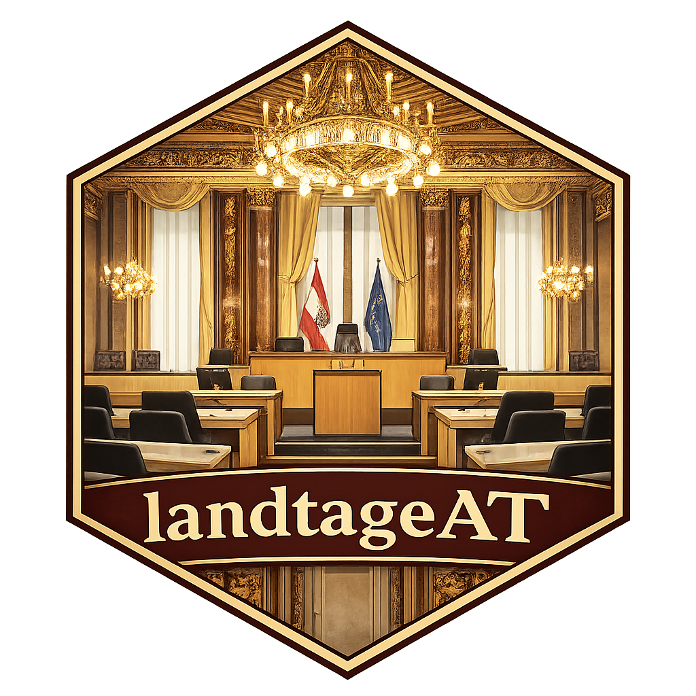

# landtageAT



`landtageAT` provides a unified R interface to parliamentary data from Austria's nine state parliaments (Landtage). The package not only provides data access through web scraping but also additional functionality for data analysis and is intended as a swiss army knife for researchers and data journalists interested in parliamentarism and regional politics in Austria.

## What the current version (v0.2.0) supports:

- listing states and backend feature coverage,
- listing plenary session and protocol links with harmonized metadata (e.g., `legislative_period`),
- downloading and extracting text from protocol files,
- enriching parliamentary data with data on state elections obtained from wahldatenbank.

## Installation

```r
install.packages("remotes")
remotes::install_github("FabianHabersack/landtageAT")
```

## Quick start

```r
library(landtageAT)

list_states()
landtage_supported_features()

# Discover protocols (state-specific backend behavior)
stm <- list_protocols("steiermark", limit = 20)
wie <- list_protocols("wien", limit = 20)

# Download documents
files <- download_protocols(stm, destdir = "data/raw")

# Extract text from a local or remote protocol
txt <- extract_protocol_text(files$file_path[[1]])
```

## Notes on heterogeneity

State systems differ strongly in structure and data scope. The package `landtageAT` standardizes the user-facing interface, while being mindful that not every state exposes the same level of detail. MP-level and speech-level data extraction remain planned extensions and are explicitly marked as such.

## Entry points used for each state

- Burgenland: https://www.bgld-landtag.at/landtagssitzungen/protokolle/xxiii-gp-protokolle
- Kärnten: https://www.ktn.gv.at/Politik/Landtag/Stenographische-Protokolle
- Niederösterreich: https://noe-landtag.gv.at/sitzungen
- Oberösterreich: https://www.land-oberoesterreich.gv.at/12182.htm
- Salzburg: https://www.salzburg.gv.at/pol/landtag/parlamentarische-materialien
- Steiermark: https://www.landtag.steiermark.at/cms/ziel/181952035
- Tirol: https://www.tirol.gv.at/landtag
- Vorarlberg: https://vorarlberg.at/web/landtag/lis
- Wien: https://www.wien.gv.at/mdb/ltg
